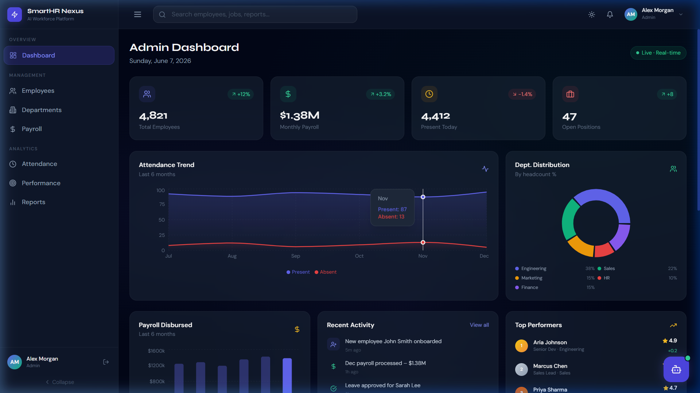
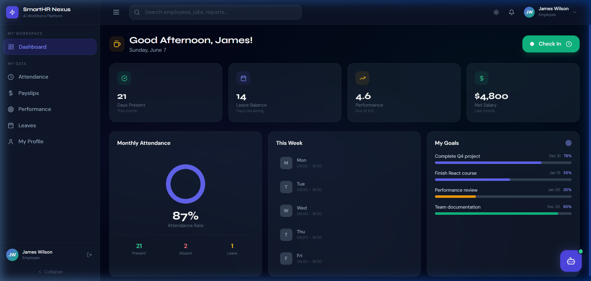
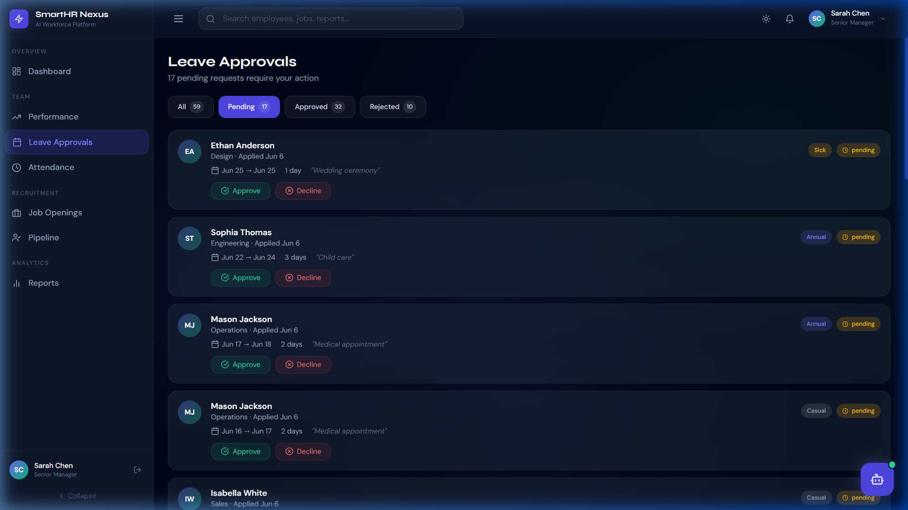
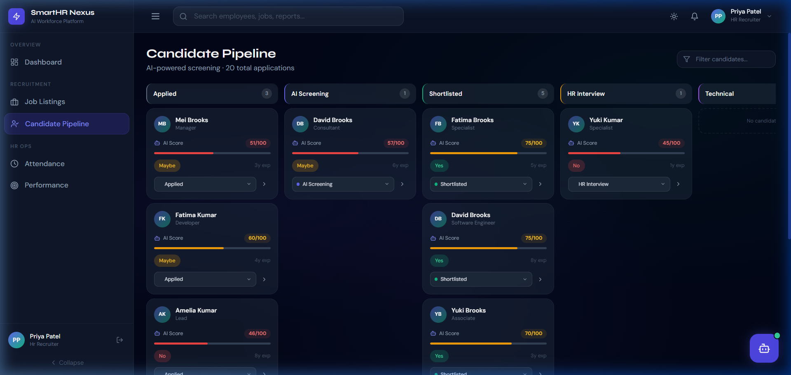
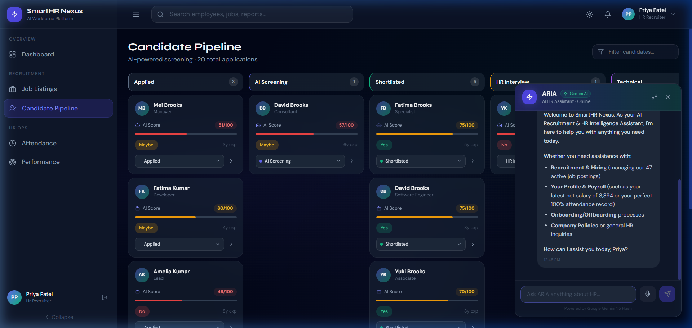

# SmartHR Nexus — Technical Details & Integrations

This file documents the full-stack integrations, features, and configuration fixes implemented to ensure persistence, reliability, and smooth routing for SmartHR Nexus on production platforms.

---

## 📅 1. Full-Stack Database Leave Integration

Originally, the Leave Management features in the frontend (`My Leaves` and `Leave Approvals`) were using static mock data arrays. They have been fully integrated with the MongoDB database.

### Architecture & Models
A Mongoose database model (`Leave`) is registered to represent employee leave requests.
* **Schema Fields:**
  * `employee`: Reference to the `User` document.
  * `leaveType`: Lowercase enum (`annual`, `sick`, `casual`, `maternity`, `paternity`, `unpaid`).
  * `reason`: String explanation.
  * `startDate` & `endDate`: ISO Date types.
  * `totalDays`: Numeric count.
  * `status`: Enum (`pending`, `approved`, `rejected`).
  * `approvedBy` & `approvedAt`: Metadata captured on action.
  * `comments`: Manager feedback.

### Backend Endpoints (`/api/v1/leaves`)
* `GET /` — Fetches leave history. Employees only see their own requests; managers/admins see all pending and historical requests.
* `POST /` — Creates a new leave request.
* `PATCH /:id/approve` — Sets status to `approved`, updates leave balances.
* `PATCH /:id/reject` — Sets status to `rejected` with comments.

### Dynamic Balance Calculation
The frontend dashboard cards now calculate leave balances dynamically:
$$\text{Remaining Balance} = \text{Total Base Days} - \sum \text{Approved Leave Days}$$
This automatically updates in real-time as soon as a manager approves a request.

---

## 🔒 2. Sign Out Reliability Fix

### The Bug
The frontend `logoutUser` Redux thunk was deleting the `accessToken` from `localStorage` **before** executing the `api.post('/auth/logout')` request. Since the Axios request interceptor pulls the token from `localStorage` to attach the `Authorization` header, the logout request was sent without headers. The backend's protected `/logout` endpoint rejected it with `401 Unauthorized`, leaving the HTTP-Only `refreshToken` cookie unrevoked on the server.

### The Fix
The `logoutUser` thunk was corrected to:
1. Read the token from `localStorage`.
2. Dispatch the logout API call while the token is still present.
3. Apply a `3-second timeout` to prevent the UI from hanging if the backend container is spinning up.
4. Remove the credentials from local memory after the request completes.

---

## 🌐 3. Vercel SPA Routing Configuration

To fix the classic single-page routing issue where refreshing deep routes (like `/dashboard/manager/leaves`) causes a Vercel `404: NOT_FOUND` error, we introduced a [vercel.json](./vercel.json) file:

```json
{
  "cleanUrls": true,
  "rewrites": [
    {
      "source": "/((?!api/|uploads/|socket.io/).*)",
      "destination": "/index.html"
    }
  ]
}
```

This ensures that:
1. Static files or API endpoints (`/api/...`) are not modified.
2. All client-side React routes are rewritten to `/index.html` on refresh, allowing React Router to correctly resolve the view.

---

## 📸 Screenshots

### 🖥️ Admin Dashboard


### 🧑‍💻 Employee Dashboard


### 📅 Manager Leave Approvals Page


### 🎯 HR Recruiter Candidate Pipeline Page


### 💬 ARIA — Floating AI HR Assistant

